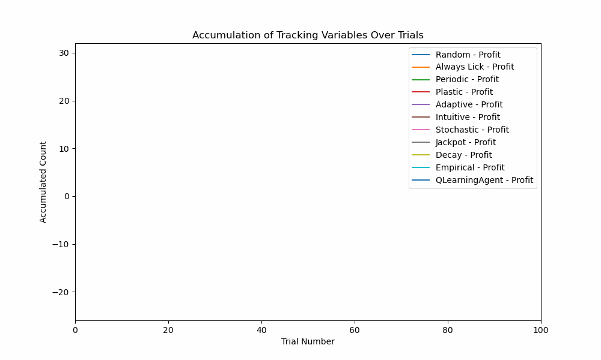

# 🚦🧠 Go/NoGo Task SIM 3000 🐭🛑


Welcome to Go/NoGo Task SIM 3000 (GTS3), a Go/No-Go Task Simulator.

## Overview

GTS3 is a Python-based simulator designed for experimenting with different strategies in a go/no-go task simulation. It allows users to explore the performance of different agents' policies against different environmental contingencies.

The Go/NoGo task is a simple cognitive task that was first developed by Donders in 1868. It consists of an agent being exposed to a cue and then deciding whether to act or not. The cue is usually binary with a GO cue associated with a reward when acted on and a NOGO cue associated with some form of punishment. There could also be an absence of cues. In such trials, the actions of the agent are usually of no consequence. This task has traditionally been used in psychology research to study action suppression and  impulsivity. However, it has found its way into experimental neuroscience to study sensorimotor representations, decision-making, and learning among other cognitive functions usually in rodent animal models. 

This simulator was created with experimental neuroscientists in mind. The aim is to provide a tool to explore the mathematical space of the expected reward and punishment for multiple parameters such as the task probability structure, number of trials, employed strategy, value of reward, etc. This is particularly important when designing animal experiments that rely on water-restricted reward-motivated protocols.




## Features

- **Strategy Exploration**: Test and compare various pre-built strategies, from random actions to q-learning agents.
- **Visualization**: Visualize the accumulation of tracking variables over trials. Or visualize how these vary over multiple simulations.
- **Data collection**: Export the results on a trial-by-trial basis into a .csv file.  
- **Flexible Experimentation**: Easily modify the number of trials, sessions, strategy, and track variables.
- **Modularity**: Easily implement your own strategy or learning agent policy/ strategy.

## How does it work?

GTS3 takes instances of a defined environment and an agent and runs the experiment for a selected number of trials:

- **The Environment class**: The environment has two attributes: "Tube state" and "Spout state"; As well as two methods: "Update tube state" and "Set spout state".
   - **Tube state** (tube_state) refers to the Go/NoGo cue. Its states can be "GO", "NOGO", or "CHECK" (absence of cue).
   - **Spout state** (spout_state) refers to the presence of reward. Its states can be "ON" or "OFF".
   - **Update tube state** (update_tube_state) is a method that updates the state of the spout based on the set probabilities.
   - **Set spout state** (set_spout_state) is a method that deterministically sets the state of the spout depending on the state of the tube.
   - ❗**CUSTOMIZE**❗: Modify the "probabilities" list in the "update_tube_state" method of the environment class to set your own environment probabilities.
 
- **The Agent class**: The agent has multiple attributes and methods. Most attributes and methods refer to storing and performing operations with information obtained throughout the session. This information can then be utilized in real-time in the decision-making policy defined in the strategies. Succinctly, depending on the strategy:
   - The agent observes the cue (tube_state). 
   - The agent selects an action based on the strategy (To Lick or to Wait).
   - The agent observes the outcome (spout_state).
   - The agent registers information about the trial.
   -  **Warning** Although the code for the QLearning Agent are methods of the Agent, **the reward structure used by the agent is not defined here**. "Rewards", "Timeouts" and "Null" are simply qualitative tracking variables.
   - ❗**CUSTOMIZE**❗: Modify the parameters learning_rate, discount_factor, epsilon to explore the QLearningAgent strategy.

- **The Experiment class**: The experiment creates instances of the agent (with the strategy) and the environment for the selected number of trials. It runs a single experiment for each strategy selected. The Updated q-value function is here. It is also where the code for the plots is.
  - ❗**CUSTOMIZE**❗: Customize the reward value and structure under the run_single_experiment method.

- **Strategies**: Strategies are functions that do not belong to any class. When called, they operate some logic and return an action (Lick or Wait).
  - ❗**CUSTOMIZE**❗: To add a new strategy/ policy simply define the function and index it in "strategies_to_simulate" You can make use of the multiple existing methods and attributes of the Agent class to define heuristics or else add new ones.
 

    
## Quick Start: Start exploring the script with a command-line interface

1. Clone the repository:
    ```bash
    git clone https://github.com/Estrondio/GoNoGo.git
    ```
2. Navigate to the project directory:
    ```bash
    cd GoNoGo
    ```
3. Open the CLI script:
    ```bash
    python SingleSessionSimulator.py
    ```
4. Follow the text instructions.

## Advanced Start: Explore different scripts with an IDE

1. Choose a file version depending on your aims:
  - **I want to simulate single sessions and generate plots**:
     ```bash
    SingleStrategies[Working].py
     ```
     - Useful to see how different strategies perform over trials.
     - Explore design protocols that are engaging and keep agents motivated.  
     - It plots  a chart and a bar plot with Rewards, Timeouts, Null and Profit (Rewards - Timeouts)

  - **I want to simulate single sessions and save my results in a .csv document**:
     ```bash
    SingleStrategiesExcel[Working].py
     ```
     - Useful to take the simulation results and perform offline / posterior data analysis

  - **I want to simulate multiple sessions**:
     ```bash
    MultipleSimulations[Working].py
     ```
     - Useful to see the averages and distribution of different variables over multiple sessions. Examples below:
     - "Having an agent with the perfect behavior, given x environmental statistics, what is the expected reward for a 100 trial session?"
     - "Having an agent with the worst behavior, given x environmental statistics, what is the expected timeout for a 100 trial session?"
     - "How much on average does it compensate to have an optimized strategy compared to a random one?"
     - This script outputs a boxplot with calculated standard deviations and median.

2. Select your strategies by commenting out the ones you don't want to run.
3. Select your parameters and add any modification that you want. (Agent parameters, Num Simulations, Strategies' parameters, Num trials, Memory size, and values to plot).
4. Run experiment.run_experiment()

## Dependencies

- Python 3.7
- Matplotlib
- NumPy

## Contribution and future features

This is a work in progress. Feel free to contribute to this repository.
Major things to implement:
* A parameter to make the value of the reward varies with time (eg. decrease linearly or exponentially to mimic satiation)
* Options to make the environment dynamic instead of static (eg. flipping the cues, flipping between sets of probabilities, depleting, etc.)
* Merge SingleStrategies and SingleStrategiesWorking into a single script with a parameter to generate the .csv file or not.
* Implement different plots and animations to better visualize the data or capture different insights.
* A GUI would be really awesome!

## License

This project is licensed under the [MIT License](LICENSE).
