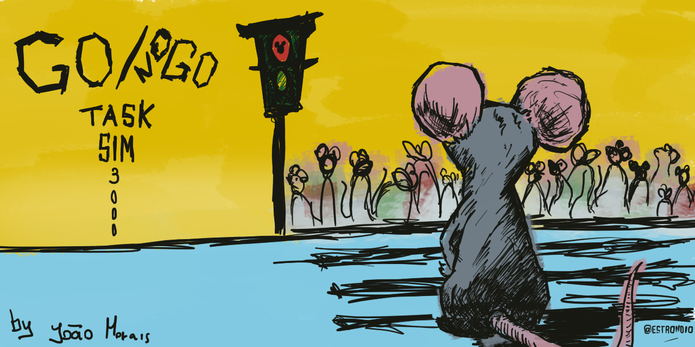

# Go/NoGo Task SIM 3000


Welcome to Go/NoGo Task SIM 3000 (GTS3), a Go/No-Go Task Simulator.

## Overview

GTS3 is a Python-based simulator designed for experimenting with different strategies in a go/no-go task simulation. It allows users to explore the performance of different agents' policies against different environmental contingencies.

## Features

- **Strategy Exploration**: Test and compare various pre-built strategies, from random actions to q-learning agents.
- **Visualization**: Visualize the accumulation of tracking variables over trials. Or visualize how these vary over multiple simulations.
- **Data collection**: Export the results on a trial-by-trial basis into a .csv file. 
- **Flexible Experimentation**: Easily modify the number of trials, sessions, strategy, and track variables.
- **Modularity**: Easily implement your own strategy or learning agent policy/ strategy.

## Getting Started

1. Clone the repository:

    ```bash
    git clone https://github.com/Estrondio/GoNoGo.git
    ```

2. Navigate to the project directory:

    ```bash
    cd GoNoGo
    ```

3. Run the experiment:

    ```bash
    python neuro_simulator.py
    ```

4. Explore the results and enjoy the journey into the world of reinforcement learning!

## Dependencies

- Python 3.x
- Matplotlib
- NumPy

## Contribution

Feel free to contribute by forking the repository and creating pull requests. If you have suggestions, improvements, or find any issues, let's collaborate to make NeuroSimGoNoGo even better!

## License

This project is licensed under the [MIT License](LICENSE).

---

Happy coding and exploring the realms of reinforcement learning!
